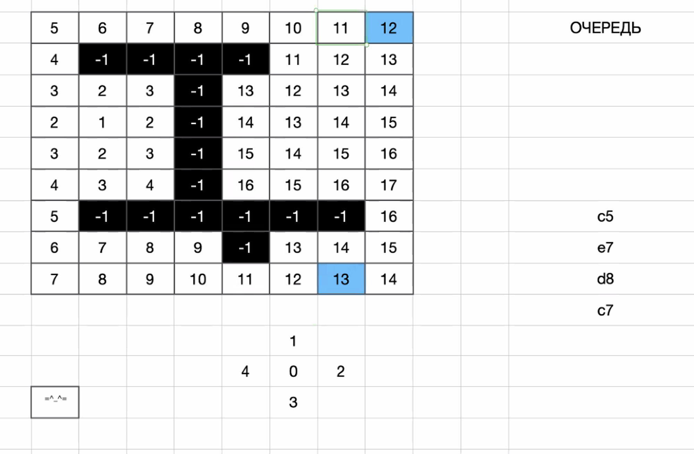

# wave-argirithm

## Реализация волнового алгоритма

1. Генератор карт - Артур
  + 1.1 статическая
  + 1 - вход
  + -2 - выход
  + -1 - стенка

int[][] getMap()
| -1 | -1 | -1 | -1 | -1 | -1 |
|----|----|----|----|----|----|
| -1 | -2 | 0  | 0  | 0  | -1 |
| -1 | -1 | -1 | -1 | 0  | -1 |
| -1 | 0  | 0  | 0  | 0  | -1 |
| -1 | 1  | 0  | 0  | 0  | -1 |
| -1 | -1 | -1 | -1 | -1 | -1 |

int[][] generateMap (int width, int height)
+ 1.2 автогенерация карт
+ 1.3 загрузка карт из файла

2. Печать карты в "сыром" виде - Александр
+ 2.1 терминал
String printMap(int[][])
+ 2.2 принтер
+ 2.3 сторонний сервис (api)

3. Печать карты в терминал красиво - Антон
String printPretty(int[][])

4. Раскраска карты - Сергей
void colorize(int[][] map)
+ 4.1 установка котика
+ 4.2 выходы
+ exit - координаты (X, Y)
+ int[][] findExits()

5. Поиск кратчайшего пути к выходу - Роман
int[][] getShortWay(int[][] map, String exit)

| -1 | -1 | -1 | -1 | -1 | -1 |
|----|----|----|----|----|----|
| -1 | -2 | 9  | 8  | 7  | -1 |
| -1 | -1 | -1 | -1 | 6  | -1 |
| -1 | 2  | 3  | 4  | 5  | -1 |
| -1 | 1  | 2  | 3  | 4  | -1 |
| -1 | -1 | -1 | -1 | -1 | -1 |

